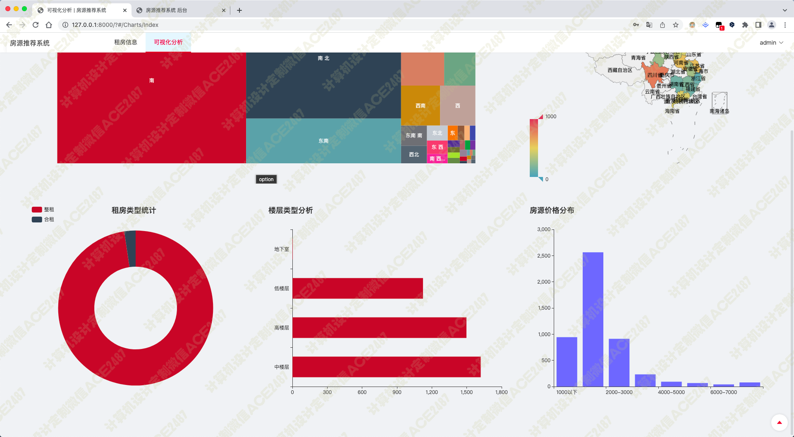
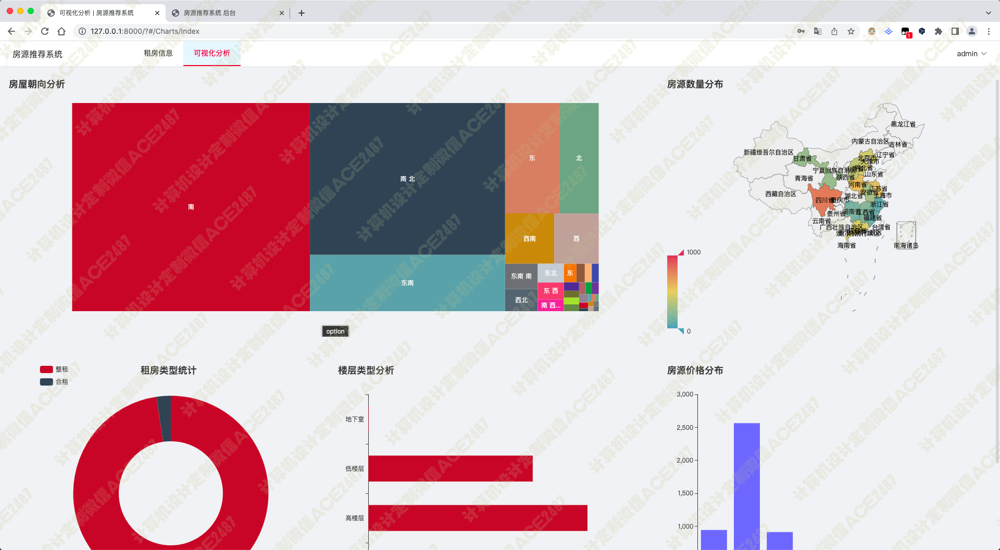
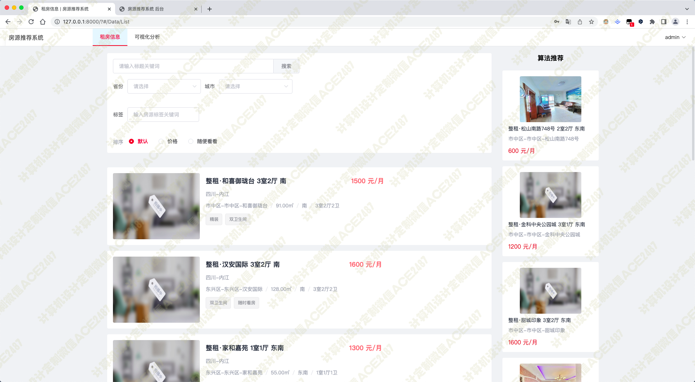
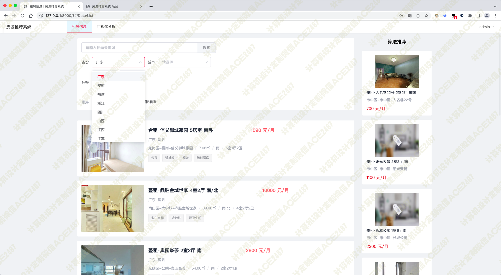
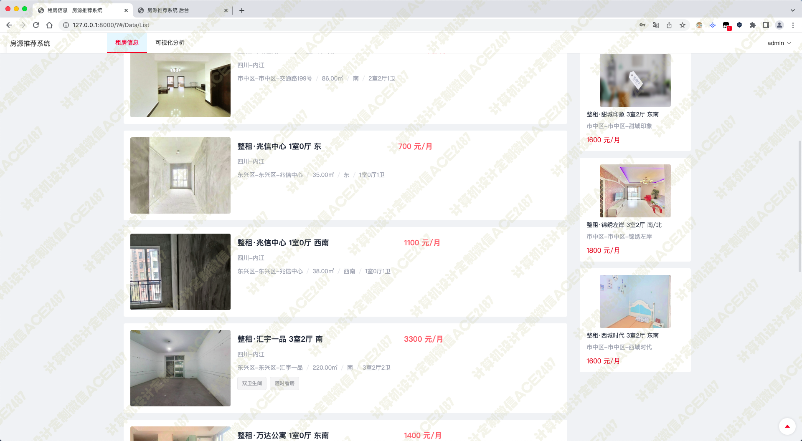
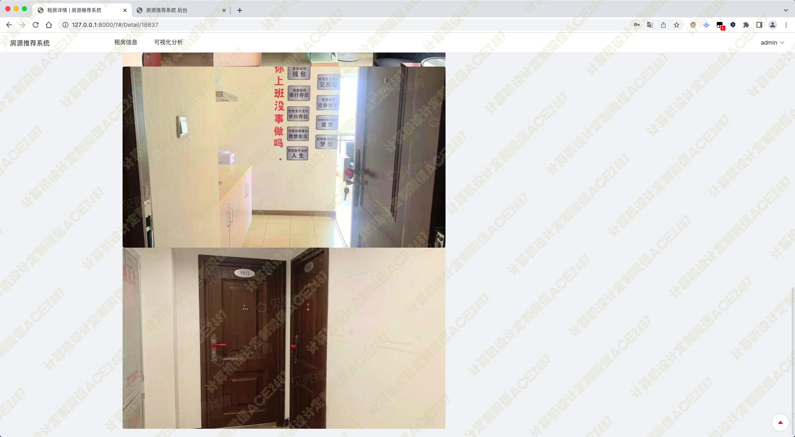
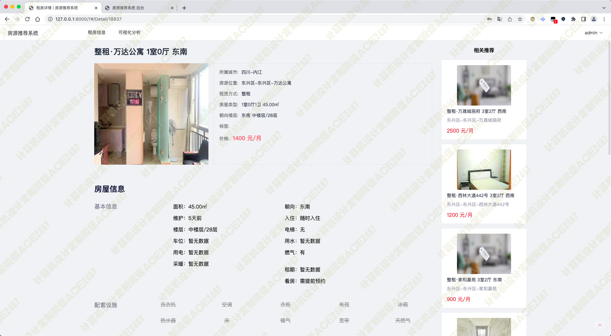
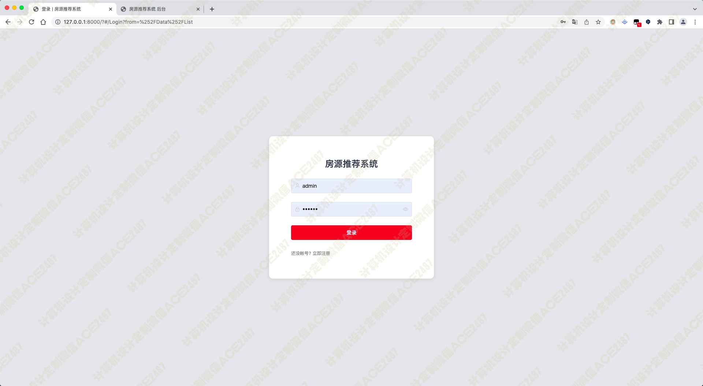
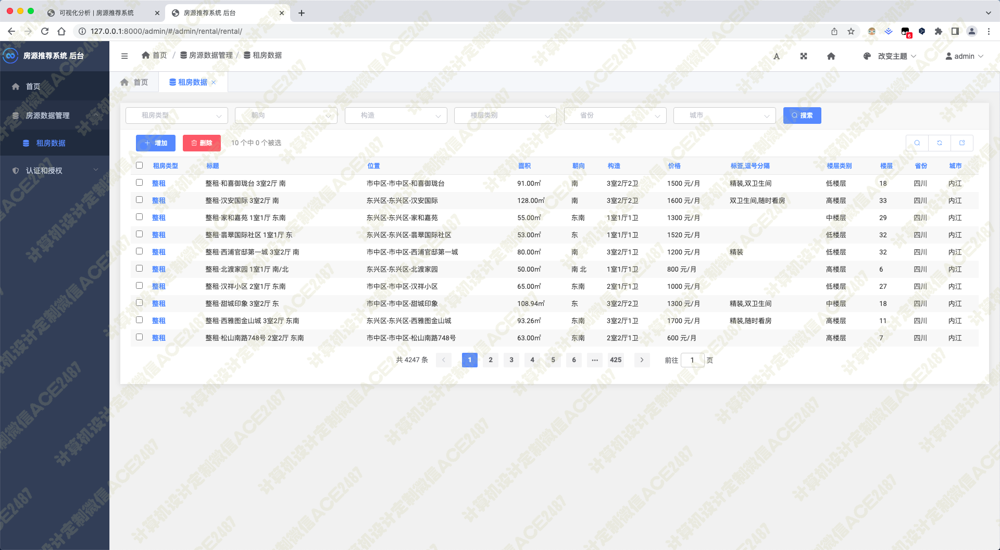
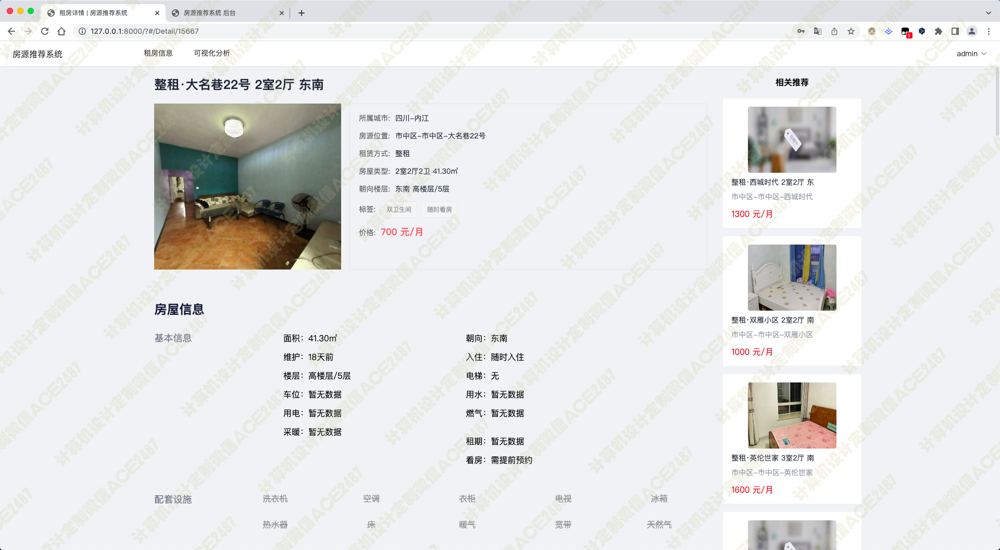

# 019 基于大数据的租房信息推荐系统-设计源码展示

> **代码有偿获取 可接受定制 微信联系方式: ACE2487，备注(BS)**

> 

## 介绍

基于大数据的租房推荐系统是一种用于帮助用户找到最适合他们的房子的系统。该系统主要功能是爬虫抓取贝壳租房网站信息，租房信息推荐，可视化分析等。使用 echarts, django, vue，协同过滤等技术。
爬虫抓取是系统的基础。通过爬虫抓取贝壳租房网站的信息，可以方便地获取想要的数据。
租房推荐是系统的核心功能。通过使用 echarts图表来可视化地展示数据，帮助用户更好地了解自己对房子的需求。通过使用 django和 vue框架来实现系统的代码，可以方便地进行开发和测试。
此外，该系统还使用了协同过滤技术来帮助用户找到最适合自己的房子。通过使用协同过滤技术，系统可以根据用户的喜好和历史经验来推荐最适合他们的房子。

## 技术栈

python django vue scrapy echarts 贝壳租房 可视化大屏 协同过滤算法 租房信息检索 房屋信息详情 推荐房源 租房类型统计 房屋朝向分析 楼层类型分析 房源价格分布 房源数量分布

## 视频

> **点击查看 \>\>\> [https://www.bilibili.com/video/BV1KM4y1k7x6/](https://www.bilibili.com/video/BV1KM4y1k7x6/)**

## 截图

